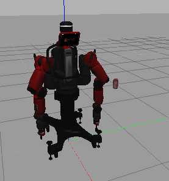

# Packages to control baxter's left end effector position

## Steps to Execute simulation

- execute the simulation script: `./baxter.sh localhost`
- start baxter simulation, when it has spawned correctly launch the second launch file in a new terminal window: (this will include all the steps below)

    `roslaunch baxter_control_sofar baxter_world.launch `
    `roslaunch baxter_control_sofar spawn.launch ` #optional and included in the first launch file

- start each node separately

    start baxter simulation

        roslaunch baxter_control_sofar baxter_world.launch

    spawn coke model

        rosrun gazebo_ros spawn_model -file /home/rick/.gazebo/models/coke_can2/model.sdf -sdf -x 0.5 -y 0.5 -z 1 -model coke_can2

    start inverse kinematic script

        rosrun baxter_control_sofar ik_service_client2_topic.py -l left

When the launch file has finished the initialization, the result will be the spawned Baxter robot with a floating Coke can spawned in front of him (the gravity and collision are disabled on this model). The can will act as a placeholder to better visualize the Baxter's left end effector position goal.

## Interact with the simulation

### Coke model
move coke model by publishing on the gazebo topic:

    rostopic pub /gazebo/set_model_state gazebo_msgs/ModelState "model_name: 'coke_can2'
    pose:
    position:
        x: 0.5
        y: 0.5
        z: 0.5" 

in alternative open a new bash script and run this command:

    rosrun baxter_control_sofar move_coke_topic.py

publish point on the topic  `/coke_can_coords`
    rostopic pub /coke_can_cods geometry_msgs/Point "x: 0.5
    y: 0.4
    z: 0.8" 

### send a goal to the end effector

rostopic pub position_sub geometry_msgs/Point "x: 0.5
y: 0.4
z: -0.1" 

## Generated topic

Most of the topics shown in the image are the ones generated by the Baxter's simulation and the control SDK.
Here follow the description of the implemented nodes:
    
  - `move_coke_can`: the node will subcribe to `/coke_can_coords` and republish the coordinate, in addition to other informations, to `/gazebo/set_model_state`. This will communicate to the Gazebo simulation that the model "coke_can2" has to change position.
  - `ee_position_control`: the node will subscribe to the topic `/position_sub`, which will contain the goal position of the left end-effector of Baxster. The node will then call Baxter's `/PositionKinematicsNode/IKService` that will return the left arm's joint position to achieve the EE positioning. The message containing the joint's position will then be published in `/robot/limb/left/joint_command`. If the goal cannot be achieived (a robot's joint could be in a singularity), the robot will move in a joint position without singularities and will try again to reach the goal, if still it cannot be reached a "FAILED" message will be printed on the terminal.