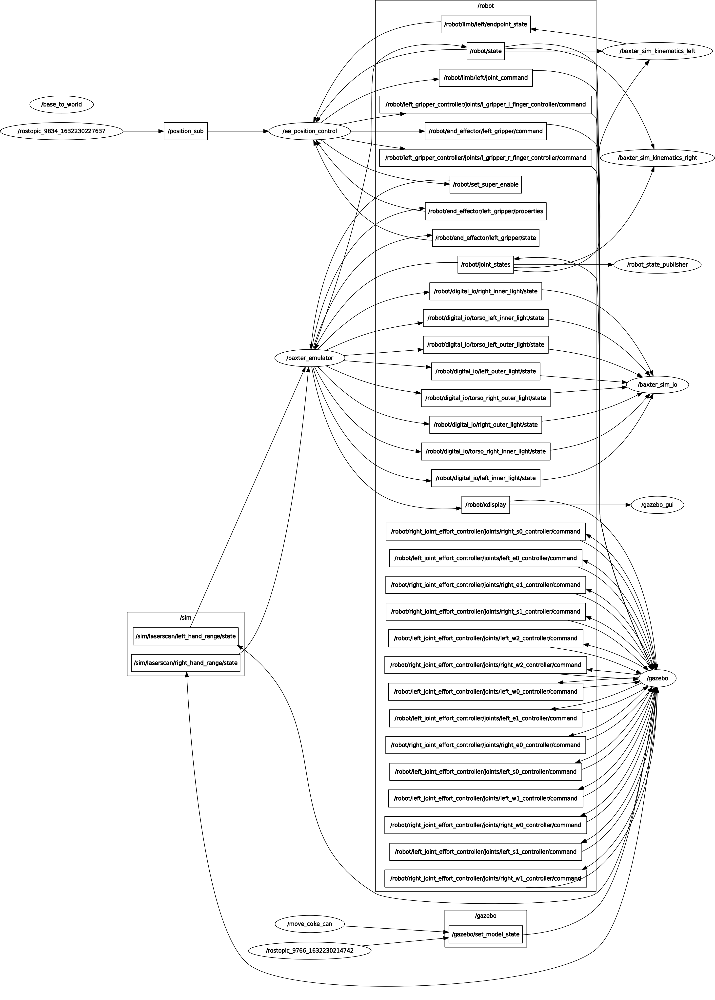

# Package to control baxter's left end effector position
BANXTER PROJECT - SOFAR - Robotics Engineering UNIGE
## Installation and requirements
- Ubuntu 16.04 x64 (https://releases.ubuntu.com/16.04/)
- Ros Kinetic (http://wiki.ros.org/kinetic/Installation/Ubuntu)
- Gazebo 7.15 (included in full installation of ROS kinetic)
- Baxter Simulator (https://sdk.rethinkrobotics.com/wiki/Simulator_Installation, following the steps for Ros Kinetic)

## Configuration
Configure the IP of the local machine: open `~/catkin_ws/baxter.sh` (i will from now on assume that `catkin_ws` is the name of the workspace)with a text editor and modify the following line by inserting the Ip address of current machine of:

    your_ip="130.251.13.108"

## Steps to launch the simulation
Execute the script to initialize the simulation

     cd ~/catkin_ws
    ./baxter.sh localhost
    roslaunch baxter_control_sofar baxter_world.launch 

Start the simulation: this launch file will spawn the baxter robot in a Gazebo simulation, together with all the services necessary. In addition, it will spawn a SDF model of a can of coke (the gravity and collision are disabled on this model). The can will act as a placeholder to better visualize the Baxter's left end effector position goal.

    

## Testing
Is possible to launch all the nodes separately to test if each one is working properly:
- Using launch files, start baxter simulation, when it has spawned correctly launch the second launch file in a new terminal window: (this will include all the steps below)

        roslaunch baxter_control_sofar baxter_world_test.launch
        roslaunch baxter_control_sofar spawn.launch 

- start each node separately

    start baxter simulation

        cd ~/catkin_ws
        roslaunch baxter_control_sofar baxter_world.launch

    spawn coke model

        rosrun gazebo_ros spawn_model -file /home/rick/.gazebo/models/coke_can2/model.sdf -sdf -x 0.5 -y 0.5 -z 1 -model coke_can2

    start inverse kinematic script

        rosrun baxter_control_sofar ik_service_client2_topic.py -l left
    
    start the script to move the model of the coke can

        rosrun baxter_control_sofar move_coke_topic.py

## Interact with the simulation

### Coke model
move coke model by publishing on the gazebo topic:

    rostopic pub /gazebo/set_model_state gazebo_msgs/ModelState "model_name: 'coke_can2'
    pose:
    position:
        x: 0.5
        y: 0.5
        z: 0.5" 

in alternative open a new bash script and run this command:

    rosrun baxter_control_sofar move_coke_topic.py

publish point on the topic  `/coke_can_coords`

    rostopic pub /coke_can_cods geometry_msgs/Point "x: 0.5
    y: 0.4
    z: 0.8" 

### send a goal to the end effector

    rostopic pub position_sub geometry_msgs/Point "x: 0.5
    y: 0.4
    z: -0.1" 

## Generated topic and nodes

Most of the topics and nodes shown in the image are the ones generated by the Baxter's simulation and the control SDK.
Here follow the description of the implemented nodes:
    
  - `move_coke_can`: the node will subcribe to `/coke_can_coords` and republish the coordinate, in addition to other informations, to `/gazebo/set_model_state`. This will communicate to the Gazebo simulation that the model "coke_can2" has to change position.
  - `ee_position_control`: the node will subscribe to the topic `/position_sub`, which will contain the goal position of the left end-effector of Baxster. The node will then call Baxter's `/PositionKinematicsNode/IKService` that will return the left arm's joint position to achieve the EE positioning. The message containing the joint's position will then be published in `/robot/limb/left/joint_command`. If the goal cannot be achieived (a robot's joint could be in a singularity), the robot will move in a joint position without singularities and will try again to reach the goal, if still it cannot be reached a "FAILED" message will be printed on the terminal.
  - `move_coke_can`: this node will subsribe to the topic `coke_can_coords` (a Point message) and it will republish to the Gazebo service `/gazebo/set_model_state` as a ModelState, to change the coke model's position in Gazebo.